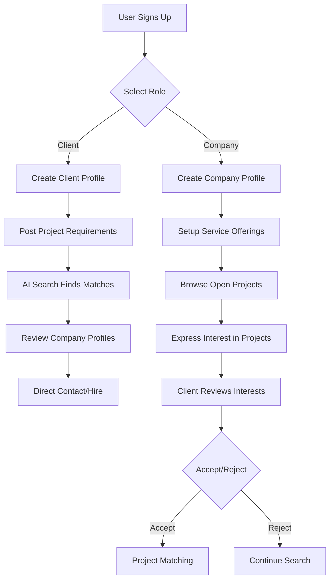
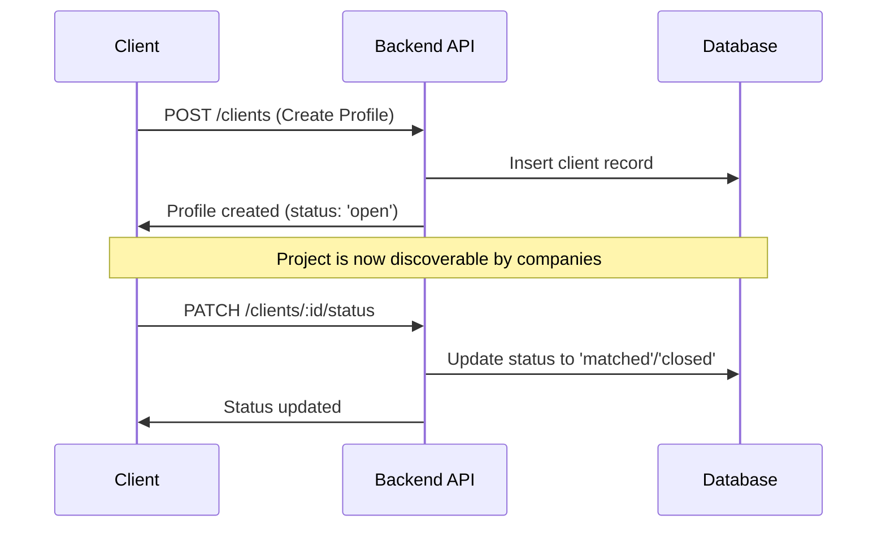
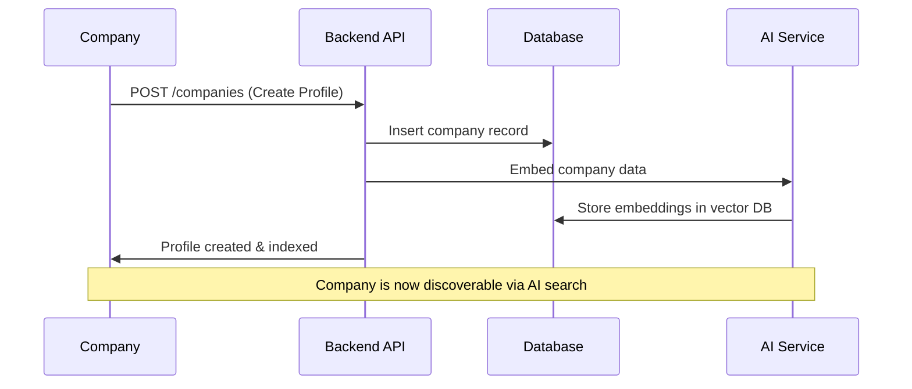
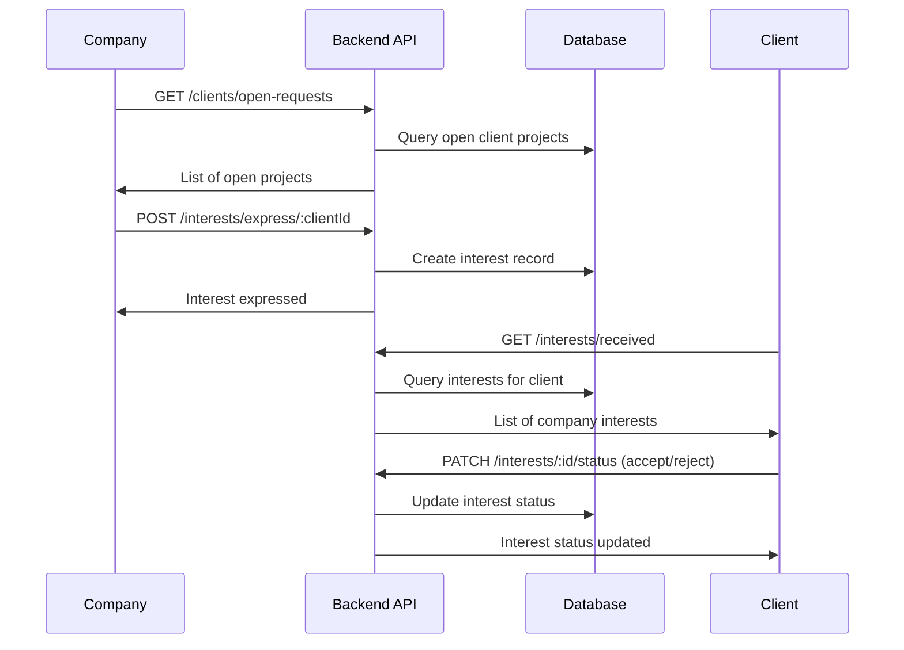

# ConnectQ Client & Company Management System

## 🏢 Complete Business Logic & API Documentation

This document provides a comprehensive overview of the Client and Company management systems in ConnectQ, including their interactions, data flows, and business processes.

---

## 📋 Table of Contents

1. [System Overview](#system-overview)
2. [Client Management System](#client-management-system)
3. [Company Management System](#company-management-system)
4. [Interest & Matching System](#interest--matching-system)
5. [API Endpoints Reference](#api-endpoints-reference)
6. [Database Schema](#database-schema)
7. [Business Workflows](#business-workflows)
8. [File Upload & Management](#file-upload--management)
9. [Security & Authorization](#security--authorization)
10. [Integration Features](#integration-features)

---

## 🌟 System Overview

ConnectQ operates as a two-sided marketplace connecting **Clients** (who need services) with **Companies** (who provide services). The system facilitates discovery, matching, and communication between these two user types.

### Core Components

```
┌─────────────────────────────────────────────────────────────────┐
│                    ConnectQ Platform                            │
├─────────────────┬─────────────────┬─────────────────┬───────────┤
│    Clients      │   Companies     │   Interests     │ AI Search │
│   (Seekers)     │  (Providers)    │  (Matching)     │ (Semantic)│
├─────────────────┼─────────────────┼─────────────────┼───────────┤
│ • Project Needs │ • Service Lists │ • Express Int.  │ • Embeddings │
│ • Requirements  │ • Portfolios    │ • Manage Status │ • Vector DB   │
│ • Status Mgmt   │ • Capabilities  │ • Notifications │ • Smart Match │
│ • Browse Offers │ • Find Clients  │ • Communication │ • Relevance   │
└─────────────────┴─────────────────┴─────────────────┴───────────┘
```

### User Journey Flow



---

## 👨‍💼 Client Management System

### Overview
Clients are individuals or businesses seeking services. They create profiles describing their project needs and requirements, then browse and evaluate service providers.

### Core Features

#### 1. **Profile Management**
- **Basic Information**: Contact details, bio, profile picture
- **Project Description**: Detailed requirements in natural language
- **Status Management**: Open, Matched, Closed project states
- **File Uploads**: Profile pictures with Cloudinary integration

#### 2. **Project Lifecycle**
```
Open → [Receiving Interests] → [Evaluating Companies] → Matched/Closed
  ↓           ↓                        ↓                    ↓
Create    Companies           Client Reviews          Final Decision
Profile   Express Int.       & Responds              & Status Update
```

### Client Controller Actions

#### 1. **Create Client Profile** (`createClient`)
```typescript
POST /api/clients
Content-Type: multipart/form-data

// Creates new client profile with optional file upload
Flow:
1. Validate user doesn't have existing client profile
2. Handle profile picture upload to Cloudinary
3. Process form data (contact, bio, description)
4. Set default status as 'open'
5. Create database record
6. Return created client profile
```

**Request Body:**
```json
{
  "contactNumber": "string (optional)",
  "bio": "string (optional)", 
  "description": "string (project requirements)",
  "status": "open|matched|closed (optional, defaults to 'open')"
}
// + profilePic file (optional)
```

#### 2. **Get My Client Profile** (`getMyClient`)
```typescript
GET /api/clients/me

// Retrieves current user's client profile
Flow:
1. Extract userId from JWT token
2. Find client profile by userId
3. Return profile data or 404 if not found
```

#### 3. **Update Client Profile** (`updateClient`)
```typescript
PUT /api/clients/:id
Content-Type: multipart/form-data

// Updates existing client profile with ownership validation
Flow:
1. Validate client exists and user owns it
2. Handle new profile picture upload (delete old one)
3. Update only provided fields
4. Log update activity
5. Return updated profile
```

#### 4. **Get Open Client Requests** (`getOpenRequests`)
```typescript
GET /api/clients/open-requests

// For companies to browse available projects
Flow:
1. Verify user has client OR company role
2. Query all clients with status='open'
3. Return list of open project requests
```

#### 5. **Update Project Status** (`updateClientStatus`)
```typescript
PATCH /api/clients/:id/status

// Change project status (open → matched → closed)
Flow:
1. Validate ownership and status value
2. Update client status in database
3. Log status change
4. Return updated client data
```

#### 6. **Delete Client Profile** (`deleteClient`)
```typescript
DELETE /api/clients/:id

// Permanent profile deletion with cleanup
Flow:
1. Validate ownership
2. Delete profile picture from Cloudinary
3. Delete database record (cascades to interests)
4. Log deletion activity
```

### Client Data Structure

```typescript
interface Client {
  id: string;
  userId: string;              // Reference to auth user
  profilePicUrl?: string;      // Cloudinary URL
  contactNumber?: string;      // Phone number
  bio?: string;               // Personal/company bio
  description?: string;       // Project requirements
  status: 'open' | 'matched' | 'closed';
  createdAt: Date;
  updatedAt: Date;
}
```

---

## 🏢 Company Management System

### Overview
Companies are service providers who create comprehensive profiles showcasing their capabilities, then browse and respond to client project requests.

### Core Features

#### 1. **Comprehensive Profiles**
- **Basic Info**: Name, email, description, industry, location
- **Branding**: Logo, website, tagline, founding date
- **Services**: Array of offered services
- **Technology Stack**: Technologies and tools used
- **Pricing & Timeline**: Cost ranges and delivery estimates
- **Scale**: Employee count, specializations
- **Reputation**: Reviews and testimonials
- **Social Presence**: LinkedIn, Twitter links

#### 2. **AI Integration**
- **Automatic Embedding**: Profile content indexed for semantic search
- **Search Optimization**: Profiles optimized for client discovery
- **Match Quality**: AI-powered relevance scoring

### Company Controller Actions

#### 1. **Create Company Profile** (`createCompany`)
```typescript
POST /api/companies
Content-Type: multipart/form-data

// Creates comprehensive company profile
Flow:
1. Validate required fields (name, email)
2. Check user doesn't have existing company
3. Handle logo upload to Cloudinary
4. Parse array fields from form data
5. Create database record
6. Trigger automatic AI embedding
7. Return created company profile
```

**Request Body:**
```json
{
  "name": "string (required)",
  "email": "string (required)",
  "description": "string",
  "industry": "string",
  "location": "string",
  "contactNumber": "string",
  "website": "string",
  "tagline": "string", 
  "foundedAt": "date",
  "services": "JSON array of strings",
  "technologiesUsed": "JSON array of strings",
  "costRange": "string (e.g., '$5k-$50k')",
  "deliveryDuration": "string (e.g., '2-6 weeks')",
  "specializations": "JSON array of strings",
  "employeeCount": "number",
  "reviews": "JSON array of strings",
  "linkedinUrl": "string",
  "twitterUrl": "string"
}
// + logo file (optional)
```

#### 2. **Get My Company Profile** (`getMyCompany`)
```typescript
GET /api/companies/me

// Retrieves current user's company profile
Flow:
1. Extract userId from JWT token
2. Find company profile by userId
3. Return complete profile data
```

#### 3. **Update Company Profile** (`updateCompany`)
```typescript
PUT /api/companies/:id
Content-Type: multipart/form-data

// Updates company profile with re-embedding
Flow:
1. Validate ownership and existence
2. Handle logo replacement (delete old, upload new)
3. Parse and update all provided fields
4. Trigger automatic re-embedding for search
5. Return updated profile
```

#### 4. **Delete Company Profile** (`deleteCompany`)
```typescript
DELETE /api/companies/:id

// Complete profile deletion with cleanup
Flow:
1. Validate ownership
2. Delete logo from Cloudinary
3. Remove AI embeddings from vector database
4. Delete database record
5. Log deletion activity
```

### Company Data Structure

```typescript
interface Company {
  id: string;
  userId: string;
  // Basic Information
  name: string;
  email: string;
  description?: string;
  industry?: string;
  location?: string;
  contactNumber?: string;
  
  // Branding
  logoUrl?: string;
  website?: string;
  tagline?: string;
  foundedAt?: Date;
  
  // Offerings
  services?: string[];
  technologiesUsed?: string[];
  costRange?: string;
  deliveryDuration?: string;
  specializations?: string[];
  
  // Scale
  employeeCount?: number;
  
  // Reputation
  reviews?: string[];
  
  // Social Links
  linkedinUrl?: string;
  twitterUrl?: string;
  
  // System
  createdAt: Date;
}
```

---

## 💝 Interest & Matching System

### Overview
The Interest system facilitates connections between companies and clients. Companies express interest in client projects, and clients manage these expressions of interest.

### Core Features

#### 1. **Interest Expression**
- Companies browse open client projects
- Express interest with optional custom message
- System prevents duplicate interest expressions
- Real-time notification system

#### 2. **Interest Management**
- Clients receive notifications of company interest  
- Review company profiles and interest messages
- Accept, reject, or keep pending
- Read/unread status tracking

### Interest Controller Actions

#### 1. **Express Interest** (`expressInterest`)
```typescript
POST /api/interests/express/:clientId

// Company expresses interest in client project
Flow:
1. Validate company profile exists
2. Check client project is open
3. Prevent duplicate interest expressions
4. Create interest record with message
5. Log interest activity
```

**Request Body:**
```json
{
  "message": "string (optional custom message)"
}
```

#### 2. **Get Company's Interests** (`getMyInterests`)
```typescript
GET /api/interests/my

// Retrieve all interests expressed by current company
Flow:
1. Find company profile for user
2. Query all interests by companyId
3. Return interest list with client details
```

#### 3. **Get Client's Received Interests** (`getClientInterests`)
```typescript
GET /api/interests/received

// Retrieve all interests received by current client
Flow:
1. Find client profile for user
2. Query all interests by clientId
3. Return interests with company details
```

#### 4. **Get Unread Count** (`getUnreadCount`)
```typescript
GET /api/interests/unread-count

// Get count of unread interests for client
Flow:
1. Find client profile for user
2. Count interests where isRead = false
3. Return unread count for notifications
```

#### 5. **Mark Interest as Read** (`markAsRead`)
```typescript
PATCH /api/interests/:interestId/read

// Mark specific interest as read
Flow:
1. Validate client ownership
2. Update isRead flag to true
3. Return updated interest
```

#### 6. **Update Interest Status** (`updateInterestStatus`)
```typescript
PATCH /api/interests/:interestId/status

// Client accepts/rejects company interest
Flow:
1. Validate status value and ownership
2. Update interest status
3. Log status change
4. Return updated interest
```

### Interest Data Structure

```typescript
interface Interest {
  id: string;
  clientId: string;       // Reference to client
  companyId: string;      // Reference to company
  message?: string;       // Custom message from company
  status: 'pending' | 'accepted' | 'rejected';
  isRead: boolean;        // For notification system
  createdAt: Date;
  updatedAt: Date;
}
```

---

## 🔗 API Endpoints Reference

### Client Endpoints
Base URL: `/api/clients`

| Method | Endpoint | Auth | Role | Description |
|--------|----------|------|------|-------------|
| POST | `/` | ✅ | Client | Create client profile |
| GET | `/me` | ✅ | Client | Get my client profile |
| GET | `/open-requests` | ✅ | Client/Company | Browse open projects |
| GET | `/:id` | ✅ | Client | Get specific client profile |
| PUT | `/:id` | ✅ | Client | Update client profile |
| PATCH | `/:id/status` | ✅ | Client | Update project status |
| DELETE | `/:id` | ✅ | Client | Delete client profile |

### Company Endpoints  
Base URL: `/api/companies`

| Method | Endpoint | Auth | Role | Description |
|--------|----------|------|------|-------------|
| POST | `/` | ✅ | Company | Create company profile |
| GET | `/me` | ✅ | Company | Get my company profile |
| GET | `/:id` | ✅ | Company | Get specific company profile |
| PUT | `/:id` | ✅ | Company | Update company profile |
| DELETE | `/:id` | ✅ | Company | Delete company profile |

### Interest Endpoints
Base URL: `/api/interests`

| Method | Endpoint | Auth | Role | Description |
|--------|----------|------|------|-------------|
| POST | `/express/:clientId` | ✅ | Company | Express interest in project |
| GET | `/my` | ✅ | Company | Get my expressed interests |
| GET | `/received` | ✅ | Client | Get interests I received |
| GET | `/unread-count` | ✅ | Client | Get unread interest count |
| PATCH | `/:interestId/read` | ✅ | Client | Mark interest as read |
| PATCH | `/:interestId/status` | ✅ | Client | Accept/reject interest |

---

## 🗄️ Database Schema

### Clients Table
```sql
CREATE TABLE clients (
  id UUID PRIMARY KEY DEFAULT gen_random_uuid(),
  user_id UUID NOT NULL REFERENCES users(id) ON DELETE CASCADE,
  profile_pic_url TEXT,
  contact_number TEXT,
  bio TEXT,
  description TEXT,                    -- Project requirements
  status TEXT CHECK (status IN ('open', 'matched', 'closed')) DEFAULT 'open',
  created_at TIMESTAMP DEFAULT NOW(),
  updated_at TIMESTAMP DEFAULT NOW()
);
```

### Companies Table
```sql
CREATE TABLE companies (
  id UUID PRIMARY KEY DEFAULT gen_random_uuid(),
  user_id UUID NOT NULL REFERENCES users(id) ON DELETE CASCADE,
  name TEXT NOT NULL,
  email TEXT NOT NULL,
  description TEXT,
  industry TEXT,
  location TEXT,
  contact_number TEXT,
  
  -- Branding
  logo_url TEXT,
  website TEXT,
  tagline TEXT,
  founded_at TIMESTAMP,
  
  -- Offerings
  services TEXT[],                     -- Array of service strings
  technologies_used TEXT[],            -- Array of technology strings
  cost_range TEXT,                     -- e.g., "$5k-$50k"
  delivery_duration TEXT,              -- e.g., "2-6 weeks"
  specializations TEXT[],              -- Array of specialization strings
  
  -- Scale
  employee_count INTEGER,
  
  -- Reputation
  reviews TEXT[],                      -- Array of review strings
  
  -- Social Links
  linkedin_url TEXT,
  twitter_url TEXT,
  
  created_at TIMESTAMP DEFAULT NOW()
);
```

### Interests Table
```sql
CREATE TABLE interests (
  id UUID PRIMARY KEY DEFAULT gen_random_uuid(),
  client_id UUID NOT NULL REFERENCES clients(id) ON DELETE CASCADE,
  company_id UUID NOT NULL REFERENCES companies(id) ON DELETE CASCADE,
  message TEXT,                        -- Optional custom message
  status TEXT CHECK (status IN ('pending', 'accepted', 'rejected')) DEFAULT 'pending',
  is_read BOOLEAN DEFAULT FALSE,       -- For notification system
  created_at TIMESTAMP DEFAULT NOW(),
  updated_at TIMESTAMP DEFAULT NOW(),
  
  UNIQUE(client_id, company_id)        -- Prevent duplicate interests
);
```

---

## 🔄 Business Workflows

### 1. Client Project Posting Workflow



### 2. Company Service Offering Workflow



### 3. Interest Expression & Matching Workflow



---

## 📁 File Upload & Management

### Upload System
- **Storage**: Cloudinary cloud storage
- **File Types**: Images only (JPEG, PNG, WebP)
- **Size Limit**: 5MB maximum
- **Processing**: Automatic optimization and resizing
- **Cleanup**: Temporary file cleanup after processing

### Upload Endpoints
- **Client Profile Pictures**: `uploadClientProfile` middleware
- **Company Logos**: `uploadCompanyLogo` middleware

### Upload Flow
```typescript
1. Multer receives file → Temp storage
2. Validate file type and size
3. Upload to Cloudinary
4. Get permanent URL
5. Store URL in database
6. Clean up temp file
7. Delete old file when replacing
```

---

## 🔐 Security & Authorization

### Role-Based Access Control

#### Client Role Restrictions
```typescript
const requireClientRole = async (req, res, next) => {
  // Verify JWT token
  // Check user.role === 'client'
  // Attach user data to request
  // Continue or deny access
}
```

#### Company Role Restrictions
```typescript
const requireCompanyRole = async (req, res, next) => {
  // Verify JWT token  
  // Check user.role === 'company'
  // Attach user data to request
  // Continue or deny access
}
```

#### Mixed Access (Browse Mode)
```typescript
const requireClientOrCompanyRole = async (req, res, next) => {
  // Allow both client AND company roles
  // Used for browsing open requests
}
```

### Ownership Validation
- **Profile Access**: Users can only view/edit their own profiles
- **Interest Management**: Only profile owners can manage their interests
- **Data Protection**: Sensitive data excluded from responses

### Security Features
- JWT token authentication
- Role-based endpoint access
- Ownership validation on all operations
- File upload validation and sanitization
- SQL injection prevention via ORM
- CORS protection

---

## 🔄 Integration Features

### 1. **AI Search Integration**
```typescript
// Automatic embedding on company create/update
embedSingleCompany(companyId)
  .then(result => {
    if (result.success) {
      logger.info(`Company embedded: ${companyId}`);
    }
  })
  .catch(error => {
    logger.error(`Embedding failed: ${companyId}`, error);
  });
```

### 2. **Cloudinary Integration**
```typescript
// Automatic image management
const uploadResult = await uploadImage(filePath, 'companies/logos');
if (uploadResult) {
  logoUrl = uploadResult.url;
  // Delete old image
  await deleteImage(oldPublicId);
}
```

### 3. **Notification System**
- Unread interest count tracking
- Real-time status updates
- Email notifications (extensible)
- Activity logging

### 4. **Analytics & Logging**
```typescript
// Comprehensive activity logging
logger.info(`Company created: ${company.name} by user ${userId}`);
logger.info(`Interest expressed: Company ${companyId} → Client ${clientId}`);
logger.info(`Status updated: ${interestId} → ${newStatus}`);
```

---

## 📊 Data Flow Summary

### Client Data Flow
```
Registration → Profile Creation → Project Posting → 
Receive Interests → Review Companies → Make Decisions → 
Project Matching/Closure
```

### Company Data Flow  
```
Registration → Profile Creation → AI Indexing → 
Browse Projects → Express Interest → 
Await Client Response → Project Acquisition
```

### System Data Flow
```
User Authentication → Role-Based Access → 
Profile Management → Interest Matching → 
Communication Facilitation → Project Completion
```

---

This comprehensive system enables efficient matching between service seekers and providers while maintaining security, scalability, and user experience. The modular design allows for easy extension and integration with additional features like messaging, payments, and project management tools.