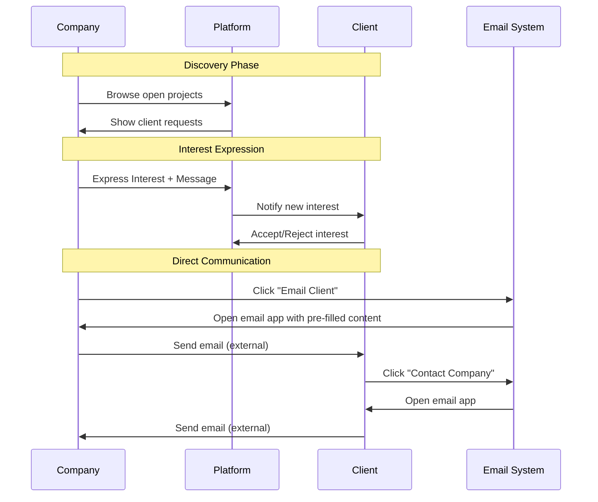

# ConnectQ Jobs & Communication System Documentation

## 📋 Jobs Model Usage & Contact Functionality Reference

This document explains the usage of `jobs.model.ts`, the communication flow when users contact each other, and the current implementation of the contact system in ConnectQ.

---

## 📖 Table of Contents

1. [Jobs Model Overview](#jobs-model-overview)
2. [Current Jobs Model Usage](#current-jobs-model-usage)
3. [Email Client Functionality](#email-client-functionality)
4. [Contact Company Functionality](#contact-company-functionality)
5. [Communication System Architecture](#communication-system-architecture)
6. [Implementation Details](#implementation-details)
7. [User Experience Flow](#user-experience-flow)
8. [Future Enhancements](#future-enhancements)

---

## 🗂️ Jobs Model Overview

### Purpose & Design
The `jobs.model.ts` file defines the database schema for structured job postings in ConnectQ, designed to support a formal job posting and application system.

### Table Structure
```typescript
export const jobs = pgTable('jobs', {
  id: uuid('id').primaryKey().defaultRandom(),
  clientId: uuid('client_id')
    .notNull()
    .references(() => clients.id, { onDelete: 'cascade' }),
  
  // Job details
  title: text('title').notNull(),
  description: text('description').notNull(),
  requirements: text('requirements'), // Optional detailed requirements
  budget: text('budget'), // e.g., "$5k-$15k" or "Fixed: $10k"
  timeline: text('timeline'), // e.g., "2-4 weeks"
  status: text('status', { enum: ['open', 'in_progress', 'completed', 'cancelled'] }).default('open'),
  
  // System timestamps
  createdAt: timestamp('created_at', { mode: 'date' }).defaultNow(),
  updatedAt: timestamp('updated_at', { mode: 'date' }).defaultNow(),
});
```

### Key Features
- **Structured Job Postings**: Formal job descriptions with requirements and budgets
- **Status Lifecycle**: `open → in_progress → completed/cancelled`
- **Client Ownership**: Each job belongs to a specific client
- **Cascade Deletion**: Jobs are deleted when the client is deleted
- **Application Support**: Designed to work with the applications system

---

## 🔄 Current Jobs Model Usage

### ⚠️ **Important Status: NOT ACTIVELY USED**

The `jobs.model.ts` is currently **defined but not actively implemented** in the application. Here's the current state:

#### **Database Integration**
✅ **Included in Database Schema**
```typescript
// drizzle.config.ts
schema: [
  './src/model/jobs.model.ts',  // ✅ Schema defined
  // ... other models
]

// db.ts  
import * as jobsSchema from './model/jobs.model';  // ✅ Imported
export const db = drizzle(client, { 
  schema: { 
    ...jobsSchema,  // ✅ Registered
    // ... other schemas
  } 
});
```

#### **Migration Status**
✅ **Database Table Created**
```sql
-- Migration 0004_round_selene.sql
CREATE TABLE "jobs" (
  "id" uuid PRIMARY KEY DEFAULT gen_random_uuid() NOT NULL,
  "client_id" uuid NOT NULL,
  "title" text NOT NULL,
  "description" text NOT NULL,
  "requirements" text,
  "budget" text,
  "timeline" text,
  "status" text DEFAULT 'open',
  "created_at" timestamp DEFAULT now(),
  "updated_at" timestamp DEFAULT now()
);
```

#### **Current Implementation Gap**
❌ **Missing Components**:
- No job controllers
- No job routes  
- No job repositories
- No job-related API endpoints
- No frontend job creation/management

#### **What's Used Instead**
The application currently uses a **simplified approach**:

```typescript
// Current approach: Using client.description field
interface Client {
  id: string;
  userId: string;
  description?: string;  // ← This acts as "job posting"
  status: 'open' | 'matched' | 'closed';
  // ... other fields
}
```

**Why This Approach:**
- **Simpler Implementation**: One description field vs. structured job data
- **Faster Development**: No need for separate job management
- **Direct Client-Company Interaction**: Companies browse client profiles directly
- **Interest-Based System**: Uses the interests table for matching

---

## 📧 Email Client Functionality

### When Company Clicks "Email Client"

Located in: `frontend/src/components/JobBrowsing.tsx`

#### **Trigger Event**
```tsx
<button
  onClick={() => handleContactClient(job)}
  className="flex items-center gap-2 bg-gray-600 hover:bg-gray-700 text-white px-4 py-2 rounded-lg font-medium transition-colors"
>
  <Mail className="w-4 h-4" />
  Email Client
</button>
```

#### **Implementation Flow**
```typescript
const handleContactClient = (job: ClientRequest) => {
  // 1. Prepare email subject
  const subject = encodeURIComponent(
    `Regarding your project: ${job.description?.substring(0, 50)}...`
  );
  
  // 2. Prepare email body  
  const body = encodeURIComponent(
    `Hi ${job.user?.name || 'there'},\n\n` +
    `I saw your project posting and would like to discuss how I can help.\n\n` +
    `Best regards`
  );
  
  // 3. Open default email client
  window.open(`mailto:${job.user?.email}?subject=${subject}&body=${body}`);
};
```

#### **What Happens Step by Step**

1. **User Action**: Company clicks "Email Client" button
2. **Data Extraction**: System extracts client's email and project info
3. **Email Composition**: Pre-fills subject and body with project context
4. **Email Client Launch**: Opens user's default email application (Gmail, Outlook, etc.)
5. **Manual Send**: Company user can edit and send the email manually

#### **Email Template Generated**
```
To: client@example.com
Subject: Regarding your project: Looking for web developer to build...

Hi John Doe,

I saw your project posting and would like to discuss how I can help.

Best regards
```

#### **Technical Details**
- **Protocol**: Uses `mailto:` protocol
- **URL Encoding**: Properly encodes subject and body for URL safety
- **Browser Handling**: Relies on browser's default email handler
- **No Server Involvement**: Direct client-side email composition

---

## 🏢 Contact Company Functionality

### When Client Clicks "Contact Company"

Located in: `frontend/src/components/SearchResults.tsx`

#### **Trigger Event**
```tsx
{/* Action Buttons */}
<div className="flex gap-4 pt-6 border-t border-gray-200">
  <button className="flex-1 bg-[#fa744c] hover:bg-[#e8633f] text-white py-4 px-6 rounded-xl font-semibold text-lg transition-colors">
    Contact Company
  </button>
</div>

{/* Quick Contact Link */}
{result.metadata.email && (
  <a
    href={`mailto:${result.metadata.email}`}
    className="flex items-center gap-1 text-[#fa744c] hover:text-[#e8633f] text-sm font-medium"
  >
    <Mail className="w-4 h-4" />
    Contact
  </a>
)}
```

#### **Implementation Flow**

**Option 1: Quick Contact Link**
```typescript
// Direct mailto link
<a href={`mailto:${result.metadata.email}`}>
  Contact
</a>
```

**Option 2: Contact Company Button**
```typescript
// Currently opens company email directly
// No custom handler implemented - relies on default mailto behavior
```

#### **What Happens Step by Step**

1. **User Action**: Client clicks "Contact Company" or "Contact" link
2. **Direct Email**: System opens email client with company's email address
3. **Manual Composition**: Client manually writes email content
4. **Manual Send**: Client sends email through their email application

#### **Email Template (Basic)**
```
To: company@example.com
Subject: (empty - client fills in)
Body: (empty - client fills in)
```

#### **Current Limitations**
- **No Pre-filling**: Unlike "Email Client", this doesn't pre-fill content
- **No Context**: Company doesn't get project context automatically
- **Manual Process**: Completely manual email composition

---

## 🏗️ Communication System Architecture

### Current Architecture

```
┌─────────────────────────────────────────────────────────────────┐
│                    ConnectQ Communication Flow                   │
├─────────────────┬─────────────────┬─────────────────┬───────────┤
│   Discovery     │   Interest      │   Direct        │   Email   │
│   (Browse)      │   (Platform)    │   Contact       │ (External)│
├─────────────────┼─────────────────┼─────────────────┼───────────┤
│ • Client Posts  │ • Express Int.  │ • Email Client  │ • Gmail   │
│ • Company Search│ • Notifications │ • Contact Co.   │ • Outlook │
│ • AI Matching   │ • Accept/Reject │ • Direct mailto │ • Default │
│ • Profile Views │ • Status Track  │ • Manual Compose│ • Mail App│
└─────────────────┴─────────────────┴─────────────────┴───────────┘
```

### Communication Channels

#### **1. Platform-Based Communication (Interests System)**
```typescript
// Interest expression (companies to clients)
POST /api/interests/express/:clientId
{
  "message": "Optional custom message"
}

// Interest management (clients manage received interests)
GET /api/interests/received
PATCH /api/interests/:id/status { "status": "accepted|rejected" }
```

**Features:**
- ✅ Tracked within platform
- ✅ Notification system
- ✅ Status management
- ✅ Message history
- ✅ Read/unread tracking

#### **2. Direct Email Communication (External)**
```typescript
// Email client (company to client)
window.open(`mailto:${clientEmail}?subject=${subject}&body=${body}`);

// Contact company (client to company)  
window.open(`mailto:${companyEmail}`);
```

**Features:**
- ✅ Direct communication
- ✅ Rich formatting
- ✅ File attachments
- ❌ Not tracked in platform
- ❌ No notification system
- ❌ No status management

### Data Flow Diagram



---

## 🛠️ Implementation Details

### Email Client Implementation

#### **JobBrowsing.tsx - Complete Function**
```typescript
const handleContactClient = (job: ClientRequest) => {
  // Simple mailto for now
  const subject = encodeURIComponent(
    `Regarding your project: ${job.description?.substring(0, 50)}...`
  );
  const body = encodeURIComponent(
    `Hi ${job.user?.name || 'there'},\n\n` +
    `I saw your project posting and would like to discuss how I can help.\n\n` +
    `Best regards`
  );
  window.open(`mailto:${job.user?.email}?subject=${subject}&body=${body}`);
};
```

#### **Key Features:**
- **Context Aware**: Includes project description in subject
- **Personalized**: Uses client's name when available
- **Professional Template**: Pre-written business communication
- **URL Safe**: Properly encodes special characters
- **Fallback Handling**: Works when name is not available

#### **Data Dependencies:**
```typescript
interface ClientRequest {
  id: string;
  description?: string;  // Used for email subject
  user?: {
    name?: string;       // Used for personalization
    email: string;       // Used for recipient
  };
}
```

### Contact Company Implementation

#### **SearchResults.tsx - Current Implementation**
```typescript
// Direct mailto link - no custom handler
<a href={`mailto:${result.metadata.email}`}>
  <Mail className="w-4 h-4" />
  Contact
</a>

// Contact Company button - currently no handler
<button className="flex-1 bg-[#fa744c] hover:bg-[#e8633f] text-white py-4 px-6 rounded-xl font-semibold text-lg transition-colors">
  Contact Company
</button>
```

#### **Missing Implementation:**
```typescript
// Potential improved implementation
const handleContactCompany = (company: SearchResult) => {
  const subject = encodeURIComponent(
    `Inquiry about your services: ${company.metadata.name}`
  );
  const body = encodeURIComponent(
    `Hi ${company.metadata.name} team,\n\n` +
    `I found your profile on ConnectQ and am interested in your services.\n\n` +
    `My project requirements:\n` +
    `[Client can describe their needs here]\n\n` +
    `Best regards`
  );
  window.open(`mailto:${company.metadata.email}?subject=${subject}&body=${body}`);
};
```

### Security & Privacy Considerations

#### **Email Address Exposure**
- **Current State**: Email addresses are visible in frontend
- **Platform Strategy**: Emails shown to encourage direct communication
- **Privacy Balance**: Open communication vs. privacy protection

#### **Mailto Protocol Security**
- **Safe Protocol**: `mailto:` is a standard, safe protocol
- **No Data Transmission**: No sensitive data sent through URL parameters
- **Client-Side Only**: All email composition happens locally

---

## 👥 User Experience Flow

### Company User Journey (Contacting Client)

```
1. Browse Projects
   ↓
2. Find Interested Project
   ↓
3. Choose Communication Method:
   a) Express Interest (Platform) → Add to interest tracker
   b) Email Client (Direct) → Open email application
   ↓
4. If Email Client:
   → Pre-filled email opens
   → Company edits/sends manually
   → Direct communication established
```

### Client User Journey (Contacting Company)

```
1. Search Companies
   ↓
2. Find Suitable Provider
   ↓
3. View Company Profile
   ↓
4. Choose Communication Method:
   a) Direct Contact Link → Opens email immediately
   b) Contact Company Button → Opens email
   ↓
5. Manual Email Composition:
   → No pre-filled content
   → Client writes from scratch
   → Direct communication established
```

### Communication Method Comparison

| Feature | Interest System | Direct Email |
|---------|----------------|--------------|
| **Tracking** | ✅ Full platform tracking | ❌ External, not tracked |
| **Notifications** | ✅ Real-time notifications | ❌ External email only |
| **Status Management** | ✅ Accept/reject workflow | ❌ Manual follow-up |
| **Message History** | ✅ Stored in platform | ❌ In email client only |
| **Pre-filled Content** | ✅ Project context included | ✅ Company→Client only |
| **Rich Content** | ❌ Plain text only | ✅ Full email formatting |
| **File Attachments** | ❌ Not supported | ✅ Full email capabilities |
| **Privacy** | ✅ Email not immediately exposed | ❌ Email address visible |

---

## 🔮 Future Enhancements

### 1. **Complete Jobs System Implementation**

#### **Missing Components to Build:**
```typescript
// Job Controller
export const createJob = async (req: Request, res: Response) => {
  // Create structured job posting
};

export const getJobs = async (req: Request, res: Response) => {
  // Get paginated job listings
};

export const updateJobStatus = async (req: Request, res: Response) => {
  // Update job status (open → in_progress → completed)
};
```

#### **Job Routes**
```typescript
// /api/jobs routes
router.post('/', verifyToken, requireClientRole, createJob);
router.get('/', verifyToken, getJobs);
router.patch('/:id/status', verifyToken, requireClientRole, updateJobStatus);
```

#### **Benefits of Full Jobs System:**
- **Structured Data**: Proper job titles, requirements, budgets
- **Better Search**: Search by job title, budget range, timeline
- **Application Tracking**: Formal application process
- **Status Management**: Track job progress through lifecycle

### 2. **Enhanced Communication System**

#### **In-Platform Messaging**
```typescript
// Message system between users
interface Message {
  id: string;
  senderId: string;
  receiverId: string;
  content: string;
  attachments?: string[];
  readAt?: Date;
  createdAt: Date;
}
```

#### **Email Integration**
```typescript
// Server-side email sending
export const sendContactEmail = async (req: Request, res: Response) => {
  const { recipientId, subject, message } = req.body;
  
  // Send email through server
  await emailService.send({
    to: recipient.email,
    subject,
    body: message,
    from: sender.email
  });
  
  // Track communication in platform
  await communicationService.log({
    senderId: req.userId,
    recipientId,
    type: 'email',
    subject,
    sentAt: new Date()
  });
};
```

#### **Notification System**
```typescript
// Real-time notifications
interface Notification {
  id: string;
  userId: string;
  type: 'new_interest' | 'new_message' | 'job_application';
  data: any;
  readAt?: Date;
  createdAt: Date;
}
```

### 3. **Contact Flow Improvements**

#### **Enhanced Email Templates**
```typescript
const generateContactEmail = (sender: User, recipient: User, context: any) => {
  return {
    subject: `ConnectQ: ${sender.name} is interested in your ${context.type}`,
    body: `
      Hi ${recipient.name},
      
      ${sender.name} found your ${context.type} on ConnectQ and would like to connect.
      
      ${context.message}
      
      You can view their profile here: ${context.profileUrl}
      
      Best regards,
      The ConnectQ Team
    `
  };
};
```

#### **Smart Contact Suggestions**
```typescript
// Suggest contact method based on user preferences
const getRecommendedContactMethod = (user: User) => {
  if (user.preferences?.directEmail) return 'email';
  if (user.preferences?.platformMessaging) return 'platform';
  return 'interest'; // Default
};
```

---

## 📊 Current System Summary

### **Jobs Model Status**
- ✅ **Database Schema**: Defined and migrated
- ✅ **TypeScript Types**: Available for use  
- ❌ **Backend Implementation**: No controllers/routes
- ❌ **Frontend Integration**: Not used in UI
- ❌ **Business Logic**: Not implemented

### **Communication System Status**
- ✅ **Interest System**: Fully implemented
- ✅ **Email Client**: Working with pre-filled content
- ⚠️ **Contact Company**: Basic implementation, needs enhancement
- ❌ **In-Platform Messaging**: Not implemented
- ❌ **Communication Tracking**: Limited to interest system

### **Recommended Next Steps**

1. **Decide on Jobs System**: Implement full jobs system or continue with simplified approach
2. **Enhance Contact Company**: Add pre-filled content and better UX
3. **Consider In-Platform Messaging**: For users who prefer not to use email
4. **Add Communication Tracking**: Track all communication attempts
5. **Improve Email Templates**: More professional and context-aware templates

---

This documentation provides a complete understanding of the current jobs model usage and communication system in ConnectQ. The system is designed for growth and can be enhanced based on user feedback and business requirements.